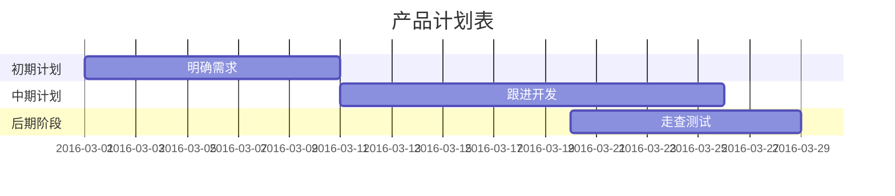

[1.一级目录](#1)
 [1.1二级目录](#1.1)
  [1.1.1三级目录](#1.1.1)

~~sasa~~

dajdlajlk^sasadaddfdaaas^

sajajl~dsdsdccscdada~

Attributes’ sets power#model for attribute based access control

##引言

***

.sanjsajka

.samklmsalk

*sjakljlkj  

*sanksjah

==vbja==
*saksb*

*saljal

>dadada

>dadada

>dadadadsad

 dsadadsadada

 dsadasdsadaaaaaaa

 >>sdadas

 >>das

 >>dasda

 >>##这是一个标题

 >>1.    第一行列表行

 >>2.	第二行列表行

 >>这里给出一些例子代码：

 >>		return shell_exec("echo $input |$markdown_script")

***

*	有序列表:这是列表的内容实施上，列表的内容应该更加简单才好

	撒娇凯撒啥

	啥叫撒撒娇哦i骄傲

*	一个列表项包含一个区块

*	有序列表2

*	有序列表3

+.	red

1.有序列表

2.有序列表2

3.有序列表3

1983\. what is this
这是一个代码引用：

	hello world

这是一个普通段落：

	这是一个代码区块。

    

    here os an example of AppleScript:

    

    	tell application "foo"

        	beep

        end call

        

        	&copy;2004 for Coporation

            

this is [an exaple](http://example.com/"Title") inline link

[this link](http://example.net) has no title attribute

this is [an example][id] reference-style link

sjaldjalk

dapoj

dajl

[id]:http://example.com/

	"Optional Title Here"

*single*

_single_

**single**

`

\\sdada

\*hjkhdjks\*

\{dsds\}

~~~c
//test1
#include <stdio.h>
#include <math.h>

void main(){
	int a
	int b

	h=a+b
	printf(h)
    return h
}

~~~

~~~java
//test
int a
int b
a=1
b=2
print(a+b)
~~~

**(sasasda)

`[百度](http://www.baidu.com)`

[dskjkd](http://www.baidu.com/)

dadad
dadad
a
adadadaa
dada
dadadad
a
da
d
ad
a
ad
ad
ada
d
a

dadadad
ada
dad
a
ad
ad
ada
d
a
da
da
d
a
da
da

d

<h1 id='1'>一级目录<h1>
<h2 id='1.1'>一级目录<h2>
<h3 id='1.1.1'>三级目录<h3>